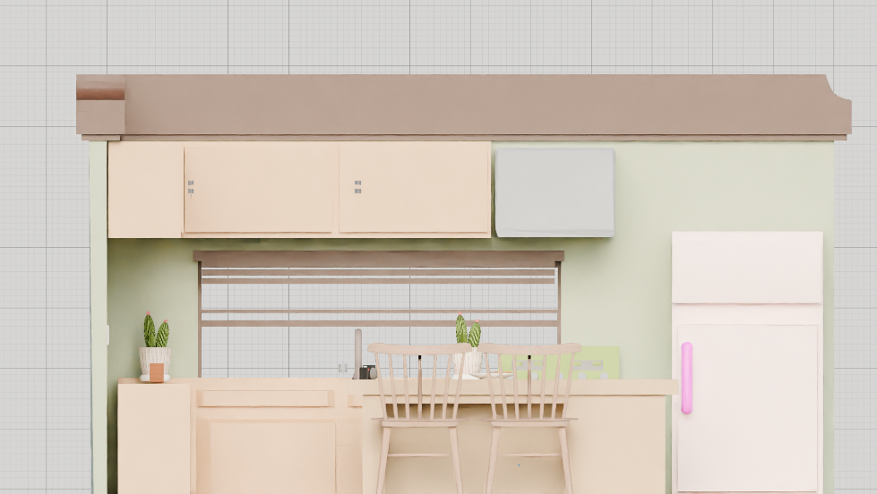

<a id="readme-top"></a>

[![Contributors][contributors-shield]][contributors-url]
[![Forks][forks-shield]][forks-url]
[![Stargazers][stars-shield]][stars-url]
[![Issues][issues-shield]][issues-url]

<br />
<div align="center">
    
    <h3 align="center">My Portfolio - Hack Club Flavourtown</h3>
    <p align="center">
        An interactive 3D portfolio website showcasing my past projects and creative skills. Built with HTML, CSS, Three.js, and Blender-created 3D models
        <br />
        <br />
        <a href="https://asusn1.github.io/profo_v1/"><strong>Try It Out »</strong></a>
        <br />
        ·
        <a href="https://github.com/ASusN1/profo_v1"><strong>View Project</strong></a>
        <br />
        ·
        <a href="https://github.com/ASusN1/profo_v1/issues">Report Bug</a>
        ·
        <a href="https://github.com/ASusN1/profo_v1/issues">Request Feature</a>
    </p>
</div>

<details>
    <summary>Table of Contents</summary>
    <ol>
        <li>
            <a href="#about-the-project">About The Project</a>
            <ul>
                <li><a href="#built-using">Built Using</a></li>
            </ul>
        </li>
        <li>
            <a href="#getting-started">Getting Started</a>
            <ul>
                <li><a href="#installation">Installation</a></li>
            </ul>
        </li>
        <li><a href="#usage">Usage</a></li>
        <li><a href="#features">Features</a></li>
        <li><a href="#file-structure">File Structure</a></li>
    </ol>
</details>

## About The Project
<br />

**My Portfolio** is an interactive 3D web experience designed to showcase my projects and creative work in an engaging, immersive environment. Navigate through a rendered 3D space created in Blender, discover my past projects through clickable interactive elements, and explore the skills I've developed across web,app development, 3D modeling.

This is my first 3D web project, I hope you guys find this helpful

<p align="right">(<a href="#readme-top">top</a>)</p>

### Built Using

* [Three.js](https://threejs.org/) - 3D JavaScript rendering library
* [JavaScript](https://www.javascript.com/) - Interactivity and logic
* [HTML5](https://www.w3.org/TR/html5/) - Markup structure
* [CSS3](https://www.w3.org/Style/CSS/) - Styling
* [Blender](https://www.blender.org/) - 3D modeling and scene creation
* [FL Studio](https://www.image-line.com/) - Background music and audio production
* [WebGL](https://www.khronos.org/webgl/) - Graphics rendering

<p align="right">(<a href="#readme-top">top</a>)</p>

## Getting Started

You can run this project directly in your browser with a simple local web server.

### Try It Out

Want to see it in action? No installation needed!

**[Visit the Live Demo](https://asusn1.github.io/profo_v1/)**

Explore the interactive 3D portfolio right now in your browser!

### Installation

**Prerequisites:**
- A modern web browser (Chrome, Firefox, Safari, Edge)
- Python 3.x (for running a local server) or any HTTP server

**Option 1: Using Python (Recommended)**

1. Clone or download the repository
   ```sh
   git clone https://github.com/ASusN1/profo_v1.git
   cd profo_v1
   ```
2. Run the local server
   ```sh
   python -m http.server 8000
   ```
3. Open your browser and navigate to
   ```
   http://localhost:8000
   ```

**Option 2: Using Node.js (Alternative)**

1. Install a simple HTTP server globally
   ```sh
   npm install -g http-server
   ```
2. Navigate to the project directory
   ```sh
   cd profo_v1
   ```
3. Start the server
   ```sh
   http-server
   ```
4. Open your browser to the provided address (usually `http://localhost:8080`)

<p align="right">(<a href="#readme-top">top</a>)</p>

## Usage

### Launching the Application

After starting your local server, open your browser and navigate to the provided address.

### Controls

**Mouse Controls:**
- **Left Click + Drag** - Rotate the camera around the scene
- **Scroll Wheel** - Zoom in and out
- **Right Click + Drag** - Pan the camera (depending on configuration)
- **Click on Objects** - Interact with clickable 3D elements

### Interacting with Objects

1. **Hover** over 3D objects to see them highlight
2. **Click** on an interactive object to open its information panel
3. **Read** the object description and click "Learn More" to access related links
4. **Close** the popup by clicking the × button or clicking elsewhere in the scene

### Navigation Tips

- Use the mouse to explore the entire 3D environment
- Zoom out for a full overview of the scene
- Zoom in for detailed inspection of specific objects
- Rotate smoothly to view objects from different angles

<p align="right">(<a href="#readme-top">top</a>)</p>

## Features

### Interactive Raycasting System
- Precise click detection on 3D objects
- Hover state visualization for better UX
- Metadata storage for each clickable object

### Configurable Object Information
Objects are defined in `clickableObjects.js`:
- Custom titles and descriptions
- External resource links
- Easy to add new interactive elements

### Audio Integration
- Background music that enhances immersion
- Auto-play with user interaction fallback
- Volume control and looping capabilities

### Performance Optimization
- Efficient rendering with Three.js
- Optimized raycasting for smooth interactions
- Scene background and lighting setup

<p align="right">(<a href="#readme-top">top</a>)</p>

## File Structure

```
profo_v1/
├── index.html                # Main HTML entry point
├── main.js                   # Core 3D scene logic and setup
├── clickableObjects.js       # Object configuration and metadata
├── proto.js                  # Prototype utilities
├── style.css                 # Application styling
├── command.txt               # Server startup commands
├── model/                    # 3D model files (.glb)
│   └── [your 3D models]
├── sound/                    # Audio files
│   └── sound_track_background.mp3
└── README.md                 # This file
```

### Key Files Explained

- **index.html** - Contains the DOM structure and popup element for displaying object information
- **main.js** - Initializes Three.js scene, camera, renderer, and handles all 3D logic
- **clickableObjects.js** - Stores configuration data for interactive objects (titles, descriptions, links)
- **style.css** - Styles the HTML elements and popup panels
- **model/** - Directory containing 3D models in GLTF (.glb) format
- **sound/** - Directory containing background audio files

<p align="right">(<a href="#readme-top">top</a>)</p>

## Contributing

Contributions are welcome! Feel free to:
1. Fork the repository
2. Create a feature branch (`git checkout -b feature/AmazingFeature`)
3. Commit your changes (`git commit -m 'Add some AmazingFeature'`)
4. Push to the branch (`git push origin feature/AmazingFeature`)
5. Open a Pull Request

<p align="right">(<a href="#readme-top">top</a>)</p>

## License

This project is licensed under the MIT License - see the [LICENSE](LICENSE) file for details.

<p align="right">(<a href="#readme-top">top</a>)</p>

---

[contributors-shield]: https://img.shields.io/github/contributors/ASusN1/profo_v1.svg?style=for-the-badge
[contributors-url]: https://github.com/ASusN1/profo_v1/graphs/contributors
[forks-shield]: https://img.shields.io/github/forks/ASusN1/profo_v1.svg?style=for-the-badge
[forks-url]: https://github.com/ASusN1/profo_v1/network/members
[stars-shield]: https://img.shields.io/github/stars/ASusN1/profo_v1.svg?style=for-the-badge
[stars-url]: https://github.com/ASusN1/profo_v1/stargazers
[issues-shield]: https://img.shields.io/github/issues/ASusN1/profo_v1.svg?style=for-the-badge
[issues-url]: https://github.com/ASusN1/profo_v1/issues
